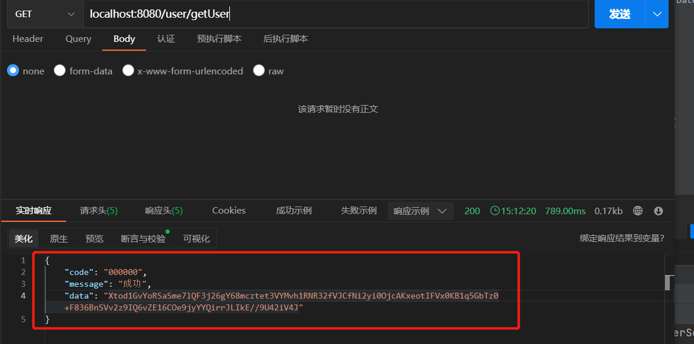

##  springboot 接口数据加解密

### AES


- 加密和解密注解标识
> @DecryptRequest：对请求数据进行解密  
> @EncryptResponse：对响应数据据进行加密

均可在类上和方法上添加加解密标识，优先取方法上的注解属性，如果方法上没有添加注解，再取类上的注解属性，如果类上也没有添加注解，则不做加解密

暂均作用与post请求，请求参数有@RequestBody标识，@DecryptRequest才生效；响应结果有@ResponseBody标识，@EncryptRequest才生效。即前后端json格式交互


- AES对称加密工具类
```java
@UtilityClass
public class AESUtils {

    private static final String AES_ALGORITHM = "AES/ECB/PKCS5Padding";

    /**
     * 获取cipher
     */
    public Cipher getCipher(byte[] key, int model) throws Exception {
        SecretKeySpec secretKeySpec = new SecretKeySpec(key, "AES");
        Cipher cipher = Cipher.getInstance(AES_ALGORITHM);
        cipher.init(model, secretKeySpec);
        return cipher;
    }

    /**
     * AES加密
     */
    public String encrypt(byte[] data, byte[] key) throws Exception {
        Cipher cipher = getCipher(key, Cipher.ENCRYPT_MODE);
        return Base64.encode(cipher.doFinal(data));
    }

    /**
     * AES解密
     */
    public byte[] decrypt(byte[] data, byte[] key) throws Exception {
        Cipher cipher = getCipher(key, Cipher.DECRYPT_MODE);
        return cipher.doFinal(Base64.decode(data)); 
    }
}
```
AES对称性加密，双方使用的是同一把密钥，在各个环境中一般不一致，所以将密钥定义在配置文件application.yml中
```yml
# AES密钥需为16位
secret:
    key: 123456789abcdefg
```
密钥属性类
```java
@Data
@Component
@ConfigurationProperties(prefix = "secret")
public class SecretProperties {
    
    private String key;
}
```

- 加密处理类EncryptResponseBodyAdvice
> 实现ResponseBodyAdvice类，重写supports和beforeBodyWrite方法
> > 1.supports：满足条件才放行。这里条件是有注解@EncryptResponse标识且value为true
> >
> > 2.beforeBodyWrite：当supports方法返回true，才会执行。该方法在数据响应之前执行，即进行加密处理后返回
> 
> 该类需要添加注解@ControllerAdvice才生效

```java
@Slf4j
@ControllerAdvice("com.coolw.api.encrypt")
@EnableConfigurationProperties(SecretProperties.class)
public class EncryptResponseBodyAdvice implements ResponseBodyAdvice<BaseResponse> {

    private final ObjectMapper om = new ObjectMapper();

    @Autowired
    private SecretProperties secretProperties;

    @Override
    public boolean supports(MethodParameter methodParameter, Class aClass) {
        // 优先读取方法上的注解标识
        EncryptResponse methodAnno = methodParameter.getMethodAnnotation(EncryptResponse.class);
        if (methodAnno == null) {
            // 读取类上的注解标识
            EncryptResponse classAnno = methodParameter.getContainingClass().getAnnotation(EncryptResponse.class);
            return classAnno != null && classAnno.value();
        }
        return methodAnno.value();
    }

    @Override
    public BaseResponse beforeBodyWrite(BaseResponse response, MethodParameter methodParameter, MediaType mediaType, Class aClass
            , ServerHttpRequest serverHttpRequest, ServerHttpResponse serverHttpResponse) {
        if (response == null) {
            return null;
        }
        Object data = response.getData();
        if (data == null) {
            return response;
        }
        byte[] keyBytes = secretProperties.getKey().getBytes(StandardCharsets.UTF_8);
        try {
            response.setData(AESUtils.encrypt(om.writeValueAsBytes(data), keyBytes));
        } catch (Exception e) {
            log.error("加密异常", e);
            throw new SecretException("加密异常");
        }
        return response;
    }
}
```

- 解密处理类DecryptRequestBodyAdvice
> 没有直接实现RequestBodyAdvice接口，而是继承子类RequestBodyAdviceAdapter，这样只需要实现supports方法，其他方法在子类中均有实现，仅需添加自己需要实现的方法重写即可
> 
> RequestBodyAdvice接口定义了四个方法：
> > 1.supports：满足条件才放行。这里条件是有注解@DecryptRequest且value为true  
> > 2.beforeBodyRead：support方法返回true才执行。该方法在接收参数转换成对象前执行，先从流加载数据，然后进行解密处理，最后重新构建HttpInputMessage对象返回  
> > 3.afterBodyRead：support方法返回true才执行。该方法在已转换为对象后执行   
> > 4.handleEmptyBody：请求体为空时执行
> 
> 该类需要添加注解@ControllerAdvice才生效


```java
@Slf4j
@ControllerAdvice("com.coolw.api.encrypt")
@EnableConfigurationProperties(SecretProperties.class)
public class DecryptRequestBodyAdvice extends RequestBodyAdviceAdapter {

    @Autowired
    private SecretProperties secretProperties;
    
    @Override
    public boolean supports(MethodParameter methodParameter, Type type, Class<? extends HttpMessageConverter<?>> aClass) {
        // 优先读取方法上的注解标识
        DecryptRequest methodAnno = methodParameter.getMethod().getAnnotation(DecryptRequest.class);
        if (methodAnno == null) {
            // 读取类上的注解标识
            DecryptRequest classAnno = methodParameter.getContainingClass().getAnnotation(DecryptRequest.class);
            return classAnno != null && classAnno.value();
        }
        return methodAnno.value();
    }

    @Override
    public HttpInputMessage beforeBodyRead(HttpInputMessage inputMessage, MethodParameter parameter, Type targetType, Class<? extends HttpMessageConverter<?>> converterType) throws IOException {
        byte[] body = new byte[inputMessage.getBody().available()];
        inputMessage.getBody().read(body);
        try {
            byte[] decrypt = AESUtils.decrypt(body, secretProperties.getKey().getBytes(StandardCharsets.UTF_8));
            final ByteArrayInputStream bais = new ByteArrayInputStream(decrypt);
            return new HttpInputMessage() {
                @Override
                public InputStream getBody() throws IOException {
                    return bais;
                }

                @Override
                public HttpHeaders getHeaders() {
                    return inputMessage.getHeaders();
                }
            };
        } catch (Exception e) {
            log.error("解密异常", e);
        }
        return super.beforeBodyRead(inputMessage, parameter, targetType, converterType);
    }
}
```

- Controller类
```java
@Slf4j
@RestController
@RequestMapping("/user")
public class UserController {

    /**
     * 加密测试
     */
    @EncryptResponse
    @GetMapping("/getUser")
    public BaseResponse<User> getUser() {
        User user = new User(1, "15000994412", "zhangsan", new Date());
        return BaseResponse.success(user);
    }

    /**
     * 解密测试
     */
    @DecryptRequest
    @PostMapping("/addUser")
    public BaseResponse<User> addUser(@RequestBody User user) {
        log.info("user:{}", user);
        return BaseResponse.success(user);
    }
}
```

加密测试


解密测试


### RSA
