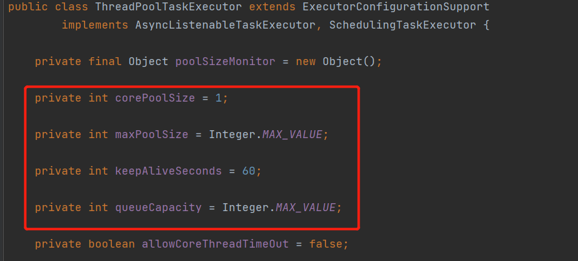

### @Async
```
@Async注解：异步处理任务
1.方法上加@Async，表示方法是异步方法
2.类上加@Async，表示类中的所有方法都是异步方法
3.使用@Async的类，需要被spring容器管理
4.在启动类或配置类上需要加@EnableAsync注解，@Async注解才有效
```

- @Async默认线程池
```
使用@Async时，如果不指定自定义的线程，@Async有默认的线程池，线程池参数：
```

可见，队列数和最大线程数的大小为`Integet.MAX_VALUE`，可以修改其配置
```yml
spring:
  task:
    execution:
      pool:
        max-size: 10
        core-size: 5
        keep-alive: 20s
        queue-capacity: 100
        thread-name-prefix: my-executor
```

- @Async失效原因
```
1.注解@Async的方法不是public修饰
2.注解@Async的方法的返回值只能是void或Future
3.注解@Async的方法不能使用static修饰
4.没有在启动类或配置类添加@EnableAsync注解
5.调用方法和@Async的方法不能在同一个类
6.在@Async方法上标注@Transactional是没用的，但在Async方法调用的方法上标注@Transcational是有效的
```

- 核心线程数设置
```
// 获取CPU处理器数
int processors = Runtime.getRuntime().availableProcessors();
```
CPU密集型:
    线程池大小设置为N，也就是和CPU的线程数相同，可以尽可能地避免线程间上下文切换，但在实际开发中，一般会设置为N+1，为了防止意外情况出现线程阻塞，如果出现阻塞，多出来的线程会继续执行任务，保证CPU的利用效率。  
IO密集型:
    线程池大小设置为2N，这个数是根据业务压测出来的，如果不涉及业务就使用推荐。
